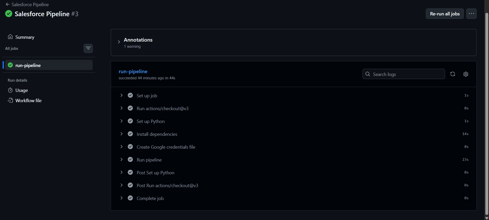
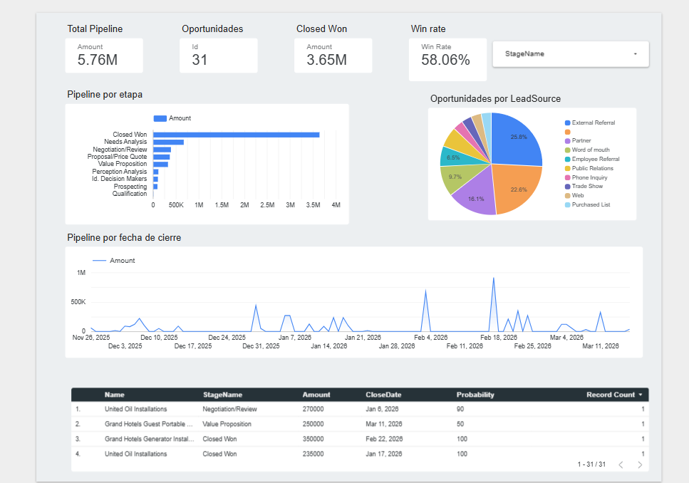

# Salesforce → BigQuery → Looker Studio Pipeline

An automated data pipeline that extracts CRM data from Salesforce, loads it into Google BigQuery, and visualizes it in a dynamic Looker Studio dashboard. Built entirely with free-tier tools and orchestrated via GitHub Actions.

## Pipeline in Action



## Architecture
```
Salesforce CRM  →  Python ETL  →  Google BigQuery  →  Looker Studio
   (Source)        (Extract &       (Data Warehouse)    (Dashboard)
                    Load)
                      ↑
               GitHub Actions
               (Orchestrator)
               Runs 2x daily
```

## Dashboard Preview



## Tech Stack

| Tool | Purpose | Cost |
|------|---------|------|
| Python 3.x | ETL scripts | Free |
| Salesforce REST API | Data source — OAuth 2.0 | Free tier |
| Google BigQuery | Cloud data warehouse | Free (10GB) |
| GitHub Actions | Scheduler & orchestration | Free (2,000 min/mo) |
| Looker Studio | Interactive dashboard | Free |

**Total infrastructure cost: $0**

## Features

- **Automated extraction** from Salesforce via OAuth 2.0 — no manual exports
- **5 objects extracted**: Opportunities, Accounts, Contacts, Leads, Campaigns
- **Deduplication** via `WRITE_TRUNCATE` — no duplicate records ever
- **Modular architecture** — add a new Salesforce object in minutes
- **Error handling** — if one table fails, the rest continue
- **Structured logging** with timestamps
- **Runs automatically** at 7am and 2pm CST every day
- **Email alerts** if the pipeline fails (via GitHub Actions)

## Why BigQuery instead of connecting directly to Salesforce?

| | Direct connection | This approach |
|--|--|--|
| Speed | Slow — Salesforce is not optimized for analytics | Fast — BigQuery is built for it |
| API limits | Consumes Salesforce API calls on every view | No API calls when viewing the dashboard |
| Consistency | Data changes in real time while viewing | Consistent snapshot — everyone sees the same data |
| Other sources | Salesforce only | Any source can feed BigQuery |
| Uptime | Dashboard breaks if Salesforce is down | Dashboard works even if Salesforce is down |
| Scalability | Limited | Foundation for a full Data Warehouse |

## Project Structure
```
salesforce-pipeline/
    pipeline.py        # Orchestrator — ties everything together
    sf_extractor.py    # Salesforce connection & data extraction
    bq_loader.py       # BigQuery connection & data loading
    objects.py         # SOQL queries and BigQuery schemas per object
    config.py          # Reads credentials from environment variables
    test_pipeline.py   # Verification script — tests all connections
    requirements.txt   # Python dependencies
    .github/
        workflows/
            pipeline.yml   # GitHub Actions workflow
```

## Setup

### Prerequisites
- Python 3.x
- Google Cloud account (BigQuery)
- Salesforce org with API access
- GitHub account

### Installation
```bash
git clone https://github.com/Ahimeleck/salesforce-bi-pipeline.git
cd salesforce-bi-pipeline
pip install -r requirements.txt
```

### Configuration

Create a `.env` file with your credentials:
```env
SF_USERNAME=your_salesforce_username
SF_PASSWORD=your_salesforce_password
SF_SECURITY_TOKEN=your_security_token
SF_CONSUMER_KEY=your_consumer_key
SF_CONSUMER_SECRET=your_consumer_secret
GOOGLE_APPLICATION_CREDENTIALS=/path/to/google-credentials.json
GCP_PROJECT_ID=your_project_id
BQ_DATASET=salesforce_data
BQ_TABLE=opportunities
```

### Verify setup
```bash
python test_pipeline.py
```

### Run manually
```bash
python pipeline.py
```

### Adding a new Salesforce object

Add an entry to the `OBJETOS` array in `objects.py`:
```python
{
    "query": "SELECT Id, Subject, Status FROM Case",
    "table_name": "cases",
    "schema": [
        bigquery.SchemaField("Id",      "STRING"),
        bigquery.SchemaField("Subject", "STRING"),
        bigquery.SchemaField("Status",  "STRING"),
    ],
    "date_cols":    [],
    "numeric_cols": []
}
```

The table is created automatically in BigQuery on the first run.

## Key Technical Decisions

**OAuth 2.0 Username-Password Flow** — used for server-to-server authentication without user interaction, enabling fully automated runs.

**Connected App (classic) vs External Client App** — Salesforce orgs created after Summer '23 default to External Client Apps, which do NOT support the Username-Password flow. A classic Connected App must be created via direct URL to enable automated authentication.

**WRITE_TRUNCATE strategy** — the entire table is replaced on each run instead of appending. This guarantees no duplicates and keeps the data fresh without complex upsert logic.

**Modular architecture** — separating extraction, loading, object definitions, and configuration into different files makes the pipeline easy to extend, test, and maintain.

## Skills Demonstrated

- REST API integration with OAuth 2.0 authentication
- ETL pipeline design and implementation
- Cloud data warehouse (Google BigQuery)
- Pipeline orchestration (GitHub Actions)
- Data visualization (Looker Studio)
- Python (requests, pandas, google-cloud-bigquery)
- Secure credential management (environment variables, GitHub Secrets)
- Modular software architecture
- Error handling and structured logging

## Author

Ahimeleck — Data Engineer
git add .
git commit -m "README con imagenes"
git push
